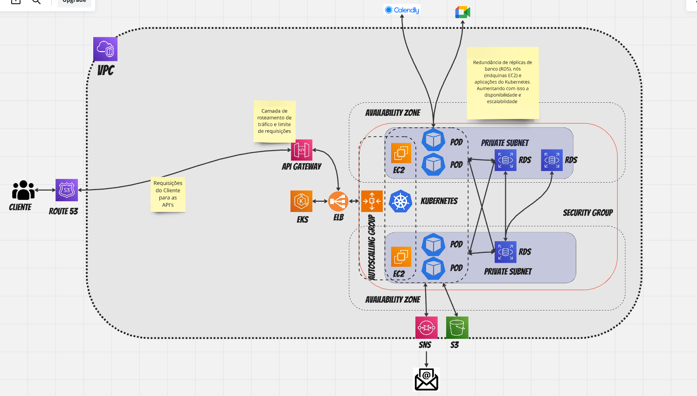

# Medilink API

Medilink é uma API desenvolvida em Node.ts como parte de um projeto de Hackathon (sendo um monolito MVP) no final do curso de pós-graduação da universidade FIAP. Esta API visa fornecer uma plataforma para a gestão eficiente de agendamento de consultas e gestão de prontuário.

## Índice

- [Funcionalidades](#funcionalidades)
- [Tecnologias Utilizadas](#tecnologias-utilizadas)
- [Instalação](#instalação)
- [Uso](#uso)
- [Deploy](#deploy)
- [Contribuição](#contribuição)
- [Licença](#licença)
- [Contato](#contato)

## Funcionalidades

- Autenticação de usuários (pacientes e médicos)
- Agendamento de Consultas
- Telemedicina
- Gestão de Prontuário

## Tecnologias Utilizadas

- **Node.ts**: Plataforma de desenvolvimento
- **Express**: Framework web para Node.js
- **TypeScript**: Superset do JavaScript que adiciona tipagem estática
- **PostgreSQL**: Banco de dados relacional
- **JWT**: Autenticação segura usando JSON Web Tokens
- **Docker**: Contêineres para simplificar o desenvolvimento e a implantação

## Instalação

Para configurar o ambiente de desenvolvimento da Medilink API, siga os passos abaixo:

1. Clone e instalação repositório:
   ```bash
   git clone https://github.com/ySodias/MediLink.git

   cd MediLink

   npm install
``

2. Definição de variáveis de ambiente:

    DATABASE_URL

3. Rodar projeto:

```bash

    npm run prisma-setup #configura prisma para o banco

    npm run start

```

### Rodar projeto através do Docker

```bash
    docker compose up

```

## Deploy

Infraestrutura de nuvem recomendada:



#### Observação: Projeto já possui pipeline automatizada do GitHub Actions, basta substituir os environments caso vá fazer o Fork
